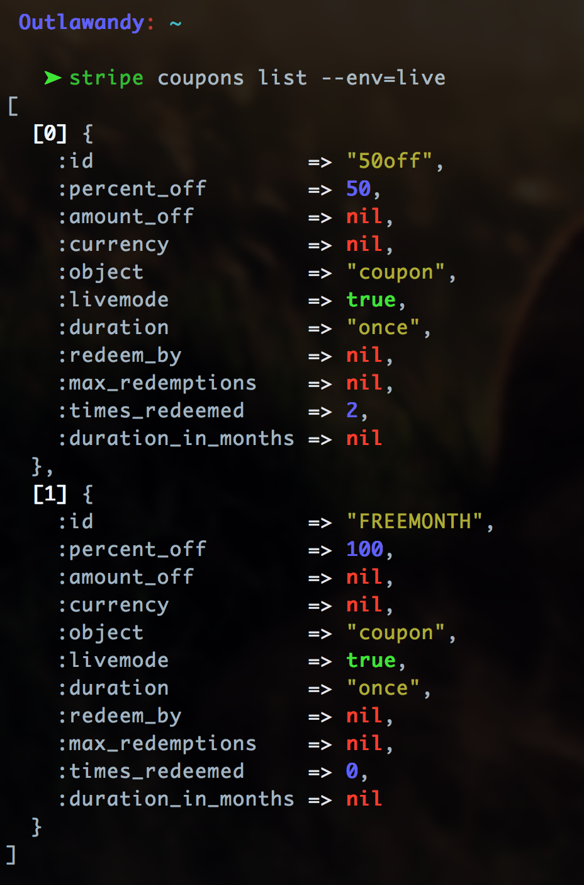
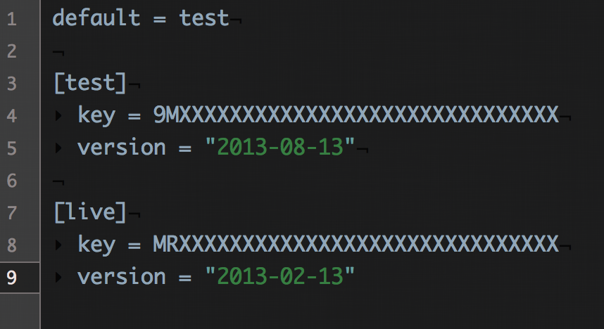

# Stripe::CLI

stripe-cli is a command line interface to [Stripe](https://stripe.com).

Uses [AwesomePrint](https://github.com/michaeldv/awesome_print) to provide very readable output on your command line.

## Installation

    $ gem install stripe-cli

## Configuration

For authentication, pass your secret key using the `-k` or `--key` option

    $ stripe events list -k XXXXXXXXXXXXXXXXXXXXXX

To use a specific api version, pass in the `-v` or `--version` option

    $ stripe balance_transactions list -v "2013-08-13"

You may also store default configurations in a `~/.stripecli` file that conforms to the following example

You may also overide the default environment setting in your config file by passing in the `-e` or `--env` option

    $ stripe customers find cust_123 --env=live

## Usage

    $ stripe

      Commands:
        stripe balance_transaction  # /balance_transactions
        stripe charges              # /charges
        stripe tokens               # /tokens
        stripe customers            # /customers
        stripe events               # /events
        stripe plans                # /plans
        stripe coupons              # /coupons
        stripe invoices             # /invoices

Any parameters accepted by the stripe api are acceptable options to pass into commands

    $ stripe charges create [--amount=AMOUNT][--description=DESC][--card_number=NUM][--card_cvc=CVC][--card_exp_month=MM][--card_exp_year=YYYY]

or

    $ stripe charges create [--amount=AMOUNT][--card=TOKEN_ID]

or

    $ stripe charges create [--amount=AMOUNT][--customer=CUST_ID]

Passing NO (or partial) arguments, will trigger an interactive menu

    $ stripe charges create
    Amount in dollars: __

or

    $ stripe charges create [--amount=AMOUNT]
    Name on Card: __

### Charges

    $ stripe charge list [--count=COUNT][--offset=OFFSET]
    $ stripe charge find ch_123
    $ stripe charge refund ch_123
    $ stripe charge capture ch_123
    $ stripe charge create

### Tokens

    $ stripe token find tok_123
    $ stripe token create TYPE (bank_account or credit_card)

### Customers

    $ stripe customer list [--count=COUNT][--offset=OFFSET]
    $ stripe customer find cust_123
    $ stripe customer delete cust_123
    $ stripe customer create

### Invoices

    $ stripe invoice list [--count=COUNT][--offset=OFFSET][--customer=CUST_ID]
    $ stripe invoice find inv_123
    $ stripe invoice close inv_123
    $ stripe invoice pay inv_123

### Plans

    $ stripe plan list [--count=COUNT][--offset=OFFSET]
    $ stripe plan find custom_plan_id
    $ stripe plan delete custom_plan_id
    $ stripe plan create

### Coupons

    $ stripe coupon list [--count=COUNT][--offset=OFFSET]
    $ stripe coupon find 25_off
    $ stripe coupon delete 25_off
    $ stripe coupon create

### Events

    $ stripe event list [--count=COUNT][--offset=OFFSET]
    $ stripe event find ev_123

### BalanceTransactions

    $ stripe balance_transaction list [--count=COUNT][--offset=OFFSET]
    $ stripe balance_transaction find trx_123

more to come soon

pull requests welcome

report issues in the issues tracker
