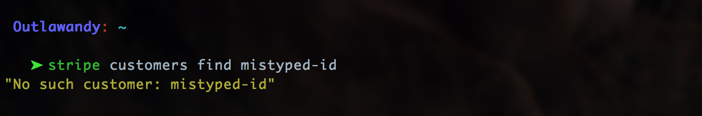
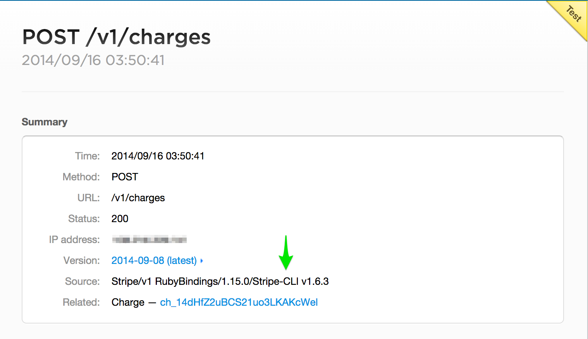

# Stripe::CLI
stripe-cli is the command line interface to [Stripe](https://stripe.com).

Offering a friendly, intuitive interface to the entire API via a git-style command suite.

With an emphasis on convenience and productivity and a commitment to pretty, colorful, but most of all READABLE output.

Uses [AwesomePrint](https://github.com/michaeldv/awesome_print) to provide very readable output on your command line.

## Installation

    $ gem install stripe-cli

## Configuration

For authentication, pass your secret key using the `-k` or `--key` option

    $ stripe events list -k sk_test_abcdef123456

To use a specific api version, pass in the `-v` or `--version` option

    $ stripe balance_transactions list -v "2014-08-04"

Explicitly passing in configuration every time is tedious. Avoid it by creating a configuration file that contains this data.

Stripe-CLI will check your home folder (**~/**) for the existance of a `.stripecli` file that conforms to the following example

If this file exists, the specified default configuration is picked up and used automatically.

The current directory is now also checked for the existance of a `.stripecli` file. In which case, that file is used instead.

As shown in the above example, you may set multiple configuration **environments** in a single file. Just make sure to specify a default.

The default **environment** may be overridden by passing in the `-e` or `--env` option to any command

    $ stripe customers find cust_123 --env=live

If you manage separate Stripe accounts for several projects, I suggest creating a simple `.stripecli` file
at the root of each project declaring the test api key for the appropriate Stripe account.

For example `./.stripecli`:

    key = sk_test_abcdef123456

or, if you'd rather:

    default = test
    [test]
      key = sk_test_abcdef123456
    [live]
      key = sk_live_ghijkl789101

If you choose to go this route, make sure to add `.stripecli` to your `.gitignore` files.

### Date/Time

By default, Date/Time stamps are converted automatically to your local machine time. No more Epoch/Unix timestamp garbage!

If you'd prefer to have time Date/Time stamps to be converted to UTC time, set the config option `dates` or `-d` to `utc`. You can also set it to `unix` to see the original Unix timestamp passed from the API. By default, it uses `local`.

### Dollars vs. Cents

By default stripe-cli expects currency amounts to be specified in **dollars**. This behavior maybe unexpected to veteran Stripe users since the raw API expects **cents**.

To change the expected currency units from **dollars** to **cents**, set the config option `dollar_amounts` to `false` in your `.stripecli` file

    dollar_amounts = false

or

    [test]
      dollar_amounts = false

If not set, this option defaults to **true** meaning that `amounts` should be in **dollars**

If you need to adjust this setting temporarily, there are global flags which maybe passed to any command

    $ stripe charge create --no-dollar-amounts
    Amount In Cents: __

    $ stripe charge create --dollar-amounts
    Amount In Dollars: __

## General Features & Flexibility

Any parameters accepted by the [stripe api](https://stripe.com/docs/api) are acceptable options to pass into commands, including metadata.

    $ stripe charges create  --amount=9.98  --description=a\ must\ have  --number=4242424242424242  --cvc=123  --exp-month=10  --exp-year=2020

or

    $ stripe charges create  --amount=16.72  --token=tok_abc123  --metadata=foo:bar meta:really\ meta\ data

or

    $ stripe charges create  --amount=1  --customer=cus_def456  --no-capture

### Interactive Menus

Passing NO (or partial) arguments to any operation, will trigger an interactive menu

    $ stripe charge create
    Amount In Dollars: __

or

    $ stripe charge create  --amount=99
    Name on Card: __

or

    $ stripe token create card --card=number:4242424242424242 name:Uther\ Pendragon cvc:911 exp-month:02
    Expiration Year: __

### cursor-based pagination

for all `list` operations

    Options:
      [--starting-after=OBJECT_ID]  # The ID of the last object in the previous paged result set.
      [--ending-before=OBJECT_ID]   # The ID of the first object in the previous paged result set, when paging backwards through the list.
      [--limit=LIMIT]               # a limit on the number of resources returned, between 1 and 100

Though Stripe advocates using cursor-based pagination, offset-based pagination is still supported.

e.g. fetching a second page

    stripe events list --count=10 --offset=10

### Exception Recovery

Api errors are rescued and their messages displayed for you to read.  No more `barfing` to `stdout`

## Usage

    Commands:
      stripe balance         # show currently available & pending balance amounts
      stripe cards           # find, list, create, & delete cards for both customers & recipients
      stripe charges         # find, list, create, capture, & refund charges
      stripe coupons         # find, list, create, & delete coupons
      stripe customers       # find, list, create, & delete customers
      stripe events          # find & list events
      stripe help [COMMAND]  # Describe available commands or one specific command
      stripe invoice_items   # find, list, create, & delete invoice items
      stripe invoices        # find, list, pay, & close invoices
      stripe plans           # find, list, create, & delete plans
      stripe recipients      # find, list, create, & delete recipients
      stripe refunds         # find, list, & create refunds
      stripe subscriptions   # find, list, create, cancel & reactivate multiple subscriptions per customer
      stripe tokens          # find & create tokens for bank accounts & credit cards
      stripe transactions    # find & list balance transactions
      stripe transfers       # find, list, & create transfers

    Global Options:
      [-k | --key=KEY]         # One of your API secret keys, provided by Stripe
      [-e | --env=ENV]         # expects a `~/.stripecli` file with section headers for any string passed into it
      [-v | --version=VERSION] # Stripe API version-date. Looks like `YYYY-MM-DD`
      [--dollar-amounts]       # configuration flag setting expected currency units to dollars
      [--no-dollar-amounts]    # configuration flag setting expected currency units to cents

## Command Documentation

- [Charges](#charges)
    - [Capture](#charge-capture)
    - [Create](#charge-create)
    - [Find](#charge-find)
    - [List](#charges-list)
    - [Refund](#charge-refund)
- [Tokens](#tokens)
    - [Create](#token-create)
    - [Find](#token-find)
- [Cards](#cards)
    - [Create](#card-create)
    - [Delete](#card-delete)
    - [Find](#card-find)
    - [List](#cards-list)
- [Customers](#customers)
    - [Create](#customer-create)
    - [Delete](#customer-delete)
    - [Find](#customer-find)
    - [List](#customers-list)
- [Subscriptions](#subscriptions)
    - [Cancel](#subscription-cancel)
    - [Create](#subscription-create)
    - [Find](#subscription-find)
    - [List](#subscriptions-list)
    - [Reactivate](#subscription-reactivate)
- [Invoices](#invoices)
    - [Close](#invoice-close)
    - [Find](#invoice-find)
    - [List](#invoices-list)
    - [Pay](#invoice-pay)
    - [Upcoming](#invoice-upcoming)
- [Invoice Items](#invoice-items)
    - [Find](#invoice-items-find)
    - [List](#invoice-items-list)
    - [Create](#invoice-items-create)
    - [Delete](#invoice-items-delete)
- [Plans](#plans)
    - [Create](#plan-create)
    - [Delete](#plan-delete)
    - [Find](#plan-find)
    - [List](#plans-list)
- [Coupons](#coupons)
    - [Create](#coupon-create)
    - [Delete](#coupon-delete)
    - [Find](#coupon-find)
    - [List](#coupons-list)
- [Events](#events)
    - [Find](#event-find)
    - [List](#events-list)
- [BalanceTransactions](#balancetransactions)
    - [Find](#transaction-find)
    - [List](#transactions-list)
- [Recipients](#recipients)
    - [Create](#recipient-create)
    - [Delete](#recipient-delete)
    - [Find](#recipient-find)
    - [List](#recipients-list)
- [Refunds](#refunds)
    - [Create](#refund-create)
    - [Find](#refund-find)
    - [List](#refunds-list)
- [Transfers](#transfers)
    - [Create](#transfer-create)
    - [Find](#transfer-find)
    - [List](#transfers-list)

<!-- end toc -->

### Charges

    Commands:
      stripe charges capture ID      # Capture a charge
      stripe charges create          # Create a charge
      stripe charges find ID         # Find a charge
      stripe charges help [COMMAND]  # Describe subcommands or one specific subcommand
      stripe charges list            # List charges (optionally by customer_id)
      stripe charges refund ID       # Refund a charge

#### Charge Capture

    Usage:
      stripe charges capture ID

    Capture a charge

#### Charge Create

    Usage:
      stripe charges create

    Options:
          [--customer=CUSTOMER]                           # The ID of an existing customer to charge
          [--token | --card=CARD]                         # credit card Token or ID. May also be created interactively.
          [--number | --card-number=CARD_NUMBER]          # credit card number. usually 16 digits long
          [--exp-month | --card-exp-month=CARD_EXP_MONTH] # Two digit expiration month of card
          [--exp-year | --card-exp-year=CARD_EXP_YEAR]    # Four digit expiration year of card
          [--cvc | --card-cvc=CARD_CVC]                   # Three or four digit security code located on the back of card
          [--name | --card-name=CARD_NAME]                # Cardholder's full name as displayed on card
          [--amount=N]                                    # Charge amount in dollars (or cents when --no-dollar-amounts)
          [--currency=CURRENCY]                           # 3-letter ISO code for currency
                                                          # Default: usd
          [--description=DESCRIPTION]                     # Arbitrary description of charge
          [--capture], [--no-capture]                     # Whether or not to immediately capture the charge. Uncaptured charges expire in 7 days
                                                          # Default: true
          [--statement-description=STATEMENT_DESCRIPTION] # Displayed alongside your company name on your customer's card statement (15 character max)
          [--receipt-email=RECEIPT_EMAIL]                 # Email address to send receipt to. Overrides default email settings.
          [--metadata=key:value]                          # A key/value store of additional user-defined data

    Create a charge

#### Charge Find

    Usage:
      stripe charges find ID

    Find a charge

#### Charges List

    Usage:
      stripe charges list

    Options:
          [--starting-after=STARTING_AFTER]  # The ID of the last object in the previous paged result set. For cursor-based pagination.
          [--ending-before=ENDING_BEFORE]    # The ID of the first object in the previous paged result set, when paging backwards through the list.
          [--limit=LIMIT]                    # a limit on the number of resources returned, between 1 and 100
          [--offset=OFFSET]                  # the starting index to be used, relative to the entire list
          [--count=COUNT]                    # deprecated: use limit
          [--customer=CUSTOMER]              # ID of customer who's charges we want to list

    List charges (optionally by customer_id)

#### Charge Refund

    Usage:
      stripe charges refund ID

    Options:
          [--amount=N]                    # Refund amount in dollars. (or cents when --no-dollar-amounts) defaults to entire charged amount
          [--refund-application-fee],     # or,
          [--no-refund-application-fee]   # Whether or not to refund the application fee
          [--metadata=key:value]          # a key/value store of additional user-defined data

    Refund a charge

### Tokens

    Commands:
      stripe tokens create TYPE           # Create a new token of type TYPE(card or account)
      stripe tokens find ID               # Find a Token
      stripe tokens help [COMMAND]        # Describe subcommands or one specific subcommand

#### Token Create

    Usage:
      stripe token create TYPE

    Options:
          [--card=key:value]                              # hash of card params. params may also be provided individually or added interactively.
          [--number | --card-number=CARD_NUMBER]          # credit card number. usually 16 digits long
          [--exp-month | --card-exp-month=CARD_EXP_MONTH] # Two digit expiration month of card
          [--exp-year | --card-exp-year=CARD_EXP_YEAR]    # Four digit expiration year of card
          [--cvc | --card-cvc=CARD_CVC]                   # Three or four digit security code located on the back of card
          [--name | --card-name=CARD_NAME]                # Cardholder's full name as displayed on card
          [--account | --bank-account=key:value]          # hash of account params. params may also be provided individually or added interactively.
          [--country=COUNTRY]                             # country of bank account. currently supports 'US' only
          [--routing-number=ROUTING_NUMBER]               # ACH routing number for bank account
          [--account-number=ACCOUNT_NUMBER]               #

    create a new token of type TYPE(card or account)

#### Token Find

    Usage:
      stripe token find ID

    Find a Token
### Cards

    Commands:
      stripe cards create --owner=OWNER     # Create a new card for OWNER (customer or recipient)
      stripe cards delete ID --owner=OWNER  # Delete ID card for OWNER (customer or recipient)
      stripe cards find ID --owner=OWNER    # Find ID card for OWNER (customer or recipient)
      stripe cards help [COMMAND]           # Describe subcommands or one specific subcommand
      stripe cards list --owner=OWNER       # List cards for OWNER (customer or recipient)

#### Card Create

    Usage:
      stripe card create --customer, --recipient, --owner=OWNER

    Options:
          [--token | --card=CARD]                     # credit card Token or ID. May also be created interactively.
          [--number | --card-number=CARD_NUMBER]
          [--exp-month | --card-exp-month=EXP_MONTH]  # Two digit expiration month of card
          [--exp-year | --card-exp-year=EXP_YEAR]     # Four digit expiration year of card
          [--cvc | --card-cvc=CARD_CVC]               # Three or four digit security code located on the back of card
          [--name | --card-name=CARD_NAME]            # Cardholder's full name as displayed on card
          --customer, --recipient, --owner=OWNER      # id of customer or recipient receiving new card

    create a new card for OWNER (customer or recipient)

#### Card Delete

    Usage:
      stripe card delete ID --owner=OWNER

    Options:
          --owner=OWNER                      # id of customer or recipient to search within

    delete ID card for OWNER (customer or recipient)

#### Card Find

    Usage:
      stripe card find ID --owner=OWNER

    Options:
          --owner=OWNER                      # id of customer or recipient to search within

    find ID card for OWNER (customer or recipient)

#### Cards List

    Usage:
      stripe cards list --owner=OWNER

    Options:
          [--starting-after=STARTING_AFTER]  # The ID of the last object in the previous paged result set. For cursor-based pagination.
          [--ending-before=ENDING_BEFORE]    # The ID of the first object in the previous paged result set, when paging backwards through the list.
          [--limit=LIMIT]                    # a limit on the number of resources returned, between 1 and 100
          [--offset=OFFSET]                  # the starting index to be used, relative to the entire list
          [--count=COUNT]                    # deprecated: use limit
          --owner=OWNER                      # id of customer or recipient to search within

    List cards for OWNER (customer or recipient)

### Customers

    Commands:
      stripe customers create          # Create a new customer
      stripe customers delete ID       # Delete a customer
      stripe customers find ID         # Find a customer
      stripe customers help [COMMAND]  # Describe subcommands or one specific subcommand
      stripe customers list            # List customers

#### Customer Create

    Usage:
      stripe customer create

    Options:
          [--description=DESCRIPTION]                     # Arbitrary description to be displayed in Stripe Dashboard.
          [--email=EMAIL]                                 # Customer's email address. Will be displayed in Stripe Dashboard.
          [--plan=PLAN]                                   # The ID of a Plan this customer should be subscribed to. Requires a credit card.
          [--coupon=COUPON]                               # The ID of a Coupon to be applied to all of Customer's recurring charges
          [--quantity=QUANTITY]                           # A multiplier for the plan option. defaults to `1'
          [--trial-end=TRIAL_END]                         # apply a trial period until this date. Override plan's trial period.
          [--account-balance=ACCOUNT_BALANCE]             # customer's starting account balance in cents. A positive amount will be added to the next invoice while a negitive amount will act as a credit.
          [--token | --card=CARD]                         # credit card Token or ID. May also be created interactively.
          [--number | --card-number=CARD_NUMBER]          # credit card number. usually 16 digits long
          [--exp-month | --card-exp-month=CARD_EXP_MONTH] # Two digit expiration month of card
          [--exp-year | --card-exp-year=CARD_EXP_YEAR]    # Four digit expiration year of card
          [--cvc | --card-cvc=CARD_CVC]                   # Three or four digit security code located on the back of card
          [--name | --card-name=CARD_NAME]                # Cardholder's full name as displayed on card
          [--metadata=key:value]                          # a key/value store of additional user-defined data

    Create a new customer

#### Customer Delete

    Usage:
      stripe customer delete ID

    Delete a customer

#### Customer Find

    Usage:
      stripe customer find ID

    Find a customer

#### Customers List

    Usage:
      stripe customers list

    Options:
          [--starting-after=STARTING_AFTER]  # The ID of the last object in the previous paged result set. For cursor-based pagination.
          [--ending-before=ENDING_BEFORE]    # The ID of the first object in the previous paged result set, when paging backwards through the list.
          [--limit=LIMIT]                    # a limit on the number of resources returned, between 1 and 100
          [--offset=OFFSET]                  # the starting index to be used, relative to the entire list
          [--count=COUNT]                    # deprecated: use limit

    List customers

### Subscriptions

    Commands:
      stripe subscriptions cancel ID --customer=CUSTOMER      # cancel ID subscription for CUSTOMER customer
      stripe subscriptions create --customer=CUSTOMER         # create a subscription for CUSTOMER customer
      stripe subscriptions find ID --customer=CUSTOMER        # find ID subscription for CUSTOMER customer
      stripe subscriptions help [COMMAND]                     # Describe subcommands or one specific subcommand
      stripe subscriptions list --customer=CUSTOMER           # List subscriptions for CUSTOMER customer
      stripe subscriptions reactivate ID --customer=CUSTOMER  # reactivate auto-renewal if `cancel-at-period-end` was set to true

#### Subscription Cancel

    Usage:
      stripe subscription cancel ID c, --customer=CUSTOMER

    Options:
          [--at-period-end], [--no-at-period-end]         # delay cancellation until end of current period, default: false
          c, --customer=CUSTOMER                          # ID of customer who's subscription we want to cancel

    cancel ID subscription for CUSTOMER customer

#### Subscription Create

    Usage:
      stripe subscription create c, --customer=CUSTOMER

    Options:
          [--plan=PLAN]                                   # the plan to assign to CUSTOMER customer
          [--coupon=COUPON]                               # id of a coupon to apply
          [--trial-end=TRIAL_END]                         # apply a trial period until this date. Override plan's trial period.
          [--token | --card=CARD]                         # credit card Token or ID. May also be created interactively.
          [--number | --card-number=CARD_NUMBER]          # credit card number. usually 16 digits long
          [--exp-month | --card-exp-month=CARD_EXP_MONTH] # Two digit expiration month of card
          [--exp-year | --card-exp-year=CARD_EXP_YEAR]    # Four digit expiration year of card
          [--cvc | --card-cvc=CARD_CVC]                   # Three or four digit security code located on the back of card
          [--name | --card-name=CARD_NAME]                # Cardholder's full name as displayed on card
          [--metadata=key:value]                          # a key/value store of additional user-defined data
          -c, --customer=CUSTOMER                         # ID of customer receiving the new subscription

    create a subscription for CUSTOMER customer

#### Subscription Find

    Usage:
      stripe subscription find ID -c, --customer=CUSTOMER

    Options:
          -c, --customer=CUSTOMER             # ID of customer to search within

    find ID subscription for CUSTOMER customer

#### Subscriptions List

    Usage:
      stripe subscriptions list -c, --customer=CUSTOMER

    Options:
          [--starting-after=STARTING_AFTER]   # The ID of the last object in the previous paged result set. For cursor-based pagination.
          [--ending-before=ENDING_BEFORE]     # The ID of the first object in the previous paged result set, when paging backwards through the list.
          [--limit=LIMIT]                     # a limit on the number of resources returned, between 1 and 100
          [--offset=OFFSET]                   # the starting index to be used, relative to the entire list
          [--count=COUNT]                     # deprecated: use limit
          -c, --customer=CUSTOMER             # ID of customer who's subscriptions we want to list

    List subscriptions for CUSTOMER customer

#### Subscription Reactivate

    Usage:
      stripe subscription reactivate ID -c, --customer=CUSTOMER

    Options:
          -c, --customer=CUSTOMER         # ID of customer who's subscription we want to reactivate

    reactivate auto-renewal if `cancel-at-period-end` was set to true

### Invoices

    Commands:
      stripe invoices close ID            # Close an unpaid invoice
      stripe invoices find ID             # Find an invoice
      stripe invoices help [COMMAND]      # Describe subcommands or one specific subcommand
      stripe invoices list                # List invoices (optionally by customer_id)
      stripe invoices pay ID              # trigger an open invoice to be paid immediately
      stripe invoices upcoming CUSTOMER   # find the upcoming invoice for CUSTOMER

#### Invoice Close

    Usage:
      stripe invoice close ID

    close an unpaid invoice

#### Invoice Find

    Usage:
      stripe invoice find ID

    Find an invoice

#### Invoices List

    Usage:
      stripe invoice list

    Options:
          [--starting-after=STARTING_AFTER]  # The ID of the last object in the previous paged result set. For cursor-based pagination.
          [--ending-before=ENDING_BEFORE]    # The ID of the first object in the previous paged result set, when paging backwards through the list.
          [--limit=LIMIT]                    # a limit on the number of resources returned, between 1 and 100
          [--offset=OFFSET]                  # the starting index to be used, relative to the entire list
          [--count=COUNT]                    # deprecated: use limit
          [--customer=CUSTOMER]              # a customer ID to filter results by

    List invoices (optionally by customer_id)

#### Invoice Pay

    Usage:
      stripe invoice pay ID

    trigger an open invoice to be paid immediately

#### Invoice Upcoming

    Usage:
      stripe invoice upcoming CUSTOMER

    find the upcoming invoice for CUSTOMER

### Invoice Items

    Commands:
      stripe invoice_items create          # Create a new invoice item for customer
      stripe invoice_items delete ID       # Delete a invoice item
      stripe invoice_items find ID         # Find an invoice item
      stripe invoice_items help [COMMAND]  # Describe subcommands or one specific subcommand
      stripe invoice_items list            # List invoice items (optionally by customer_id)

#### Invoice Item Create

    Usage:
      stripe create

    Options:
          [--customer=CUSTOMER]                      # The ID of customer for the invoice item
          [--amount=N]                               # Amount in dollars (or cents when --no-dollar-amounts)
          [--currency=CURRENCY]                      # 3-letter ISO code for currency
                                                     # Default: usd
          [--description=DESCRIPTION]                # Arbitrary description of charge
          [--invoice=INVOICE]                        # The ID of an existing invoice to add this invoice item to
          [--subscription=SUBSCRIPTION]              # The ID of a subscription to add this invoice item to
          [--discountable], [--no-discountable]      # Controls whether discounts apply to this invoice item
          [--metadata=key:value]                     # A key/value store of additional user-defined data

    Create a new invoice item for customer

#### Invoice Item Delete

    Usage:
      stripe delete ID

    Delete a invoice item

#### Invoice Item Find

    Usage:
      stripe find ID

    Find an invoice item

#### Invoice Item List

    Usage:
      stripe list

    Options:
          [--starting-after=STARTING_AFTER]          # The ID of the last object in the previous paged result set. For cursor-based pagination.
          [--ending-before=ENDING_BEFORE]            # The ID of the first object in the previous paged result set, when paging backwards through the list.
          [--limit=LIMIT]                            # a limit on the number of resources returned, between 1 and 100
          [--offset=OFFSET]                          # the starting index to be used, relative to the entire list
          [--count=COUNT]                            # deprecated: use limit
          [--customer=CUSTOMER]                      # ID of customer who's invoice items we want to list

    List invoice items (optionally by customer_id)

### Plans

    Commands:
      stripe plans create          # Create a new plan
      stripe plans delete ID       # Delete a plan
      stripe plans find ID         # Find a plan
      stripe plans help [COMMAND]  # Describe subcommands or one specific subcommand
      stripe plans list            # List plans

#### Plan Create

    Usage:
      stripe plans create

    Options:
          [--name=NAME]            # Name displayed on invoices and in the Dashboard
          [--id=ID]                # Unique name used to identify this plan when subscribing a customer
          [--amount=N]             # Amount in dollars (or cents when --no-dollar-amounts)
          [--interval=INTERVAL]    # Billing frequency
                                   # Possible values: day, week, month, year
                                   # Default: month
          [--interval-count=N]     # The number of intervals between each subscription billing.
                                   # Default: 1
          [--currency=CURRENCY]    # 3-letter ISO code for currency
                                   # Default: usd
          [--trial-period-days=N]  # Number of days to delay a customer's initial bill
                                   # Default: 0
          [--metadata=key:value]   # a key/value store of additional user-defined data

    Create a new plan

#### Plan Delete

    Usage:
      stripe plans delete ID

    Delete a plan

#### Plan Find

    Usage:
      stripe plans find ID

    Find a plan

#### Plans List

    Usage:
      stripe plans list

    Options:
          [--starting-after=STARTING_AFTER]          # The ID of the last object in the previous paged result set. For cursor-based pagination.
          [--ending-before=ENDING_BEFORE]            # The ID of the first object in the previous paged result set, when paging backwards through the list.
          [--limit=LIMIT]                            # a limit on the number of resources returned, between 1 and 100
          [--offset=OFFSET]                          # the starting index to be used, relative to the entire list
          [--count=COUNT]                            # deprecated: use limit

    List plans

### Coupons

    Commands:
      stripe coupons create                          # Create a new Coupon
      stripe coupons delete ID                       # Delete a coupon
      stripe coupons find ID                         # Find a coupon
      stripe coupons help [COMMAND]                  # Describe subcommands or one specific subcommand
      stripe coupons list                            # List coupons

#### Coupon Create

    Usage:
      stripe coupon create

    Options:
          [--id=ID]                                  # Unique name to identify this coupon
          [--percent-off=N]                          # a discount of this percentage of the subtotal
          [--amount-off=N]                           # a discount of this amount. Regardless of the subtotal
          [--duration=DURATION]                      # describes how long to apply the discount
                                                     # Possible values: forever, once, repeating
          [--redeem-by=REDEEM_BY]                    # last acceptable date to redeem coupon.
          [--max-redemptions=N]                      # The maximum number of times this coupon may be redeemed
          [--duration-in-months=DURATION_IN_MONTHS]  # number of months to apply the discount. *Only if `duration` is `repeating`
          [--currency=CURRENCY]                      # 3-letter ISO code for currency
                                                     # Default: usd
          [--metadata=key:value]                     # a key/value store of additional user-defined data

    Create a new Coupon

#### Coupon Delete

    Usage:
      stripe coupon delete ID

    Delete a coupon

#### Coupon Find

    Usage:
      stripe coupon find ID

    Find a coupon

#### Coupons List

    Usage:
      stripe coupons list

    Options:
          [--starting-after=STARTING_AFTER]   # The ID of the last object in the previous paged result set. For cursor-based pagination.
          [--ending-before=ENDING_BEFORE]     # The ID of the first object in the previous paged result set, when paging backwards through the list.
          [--limit=LIMIT]                     # a limit on the number of resources returned, between 1 and 100
          [--offset=OFFSET]                   # the starting index to be used, relative to the entire list
          [--count=COUNT]                     # deprecated: use limit

    List coupons

### Events

    Commands:
      stripe events find ID                   # Find a event
      stripe events help [COMMAND]            # Describe subcommands or one specific subcommand
      stripe events list                      # List events

#### Event Find

    Usage:
      stripe event find ID

    Find a event

#### Events List

    Usage:
      stripe events list

    Options:
          [--starting-after=STARTING_AFTER]   # The ID of the last object in the previous paged result set. For cursor-based pagination.
          [--ending-before=ENDING_BEFORE]     # The ID of the first object in the previous paged result set, when paging backwards through the list.
          [--limit=LIMIT]                     # a limit on the number of resources returned, between 1 and 100
          [--offset=OFFSET]                   # the starting index to be used, relative to the entire list
          [--count=COUNT]                     # deprecated: use limit
          [--object-id=OBJECT_ID]             # only list events pertaining to the object with this ID
          [--type=TYPE]                       # only list events of type TYPE

    List events

### BalanceTransactions

    Commands:
      stripe transactions find ID             # Find a transaction
      stripe transactions help [COMMAND]      # Describe subcommands or one specific subcommand
      stripe transactions list [TYPE]         # List transactions, optionaly filter by type:(charge refund adjustment application_fee application_fee_refund transfer transfer_failure)

#### Transaction Find

    Usage:
      stripe transaction find ID

    Find a transaction

#### Transactions List

    Usage:
      stripe transactions list [TYPE]

    Options:
          [--starting-after=STARTING_AFTER]   # The ID of the last object in the previous paged result set. For cursor-based pagination.
          [--ending-before=ENDING_BEFORE]     # The ID of the first object in the previous paged result set, when paging backwards through the list.
          [--limit=LIMIT]                     # a limit on the number of resources returned, between 1 and 100
          [--offset=OFFSET]                   # the starting index to be used, relative to the entire list
          [--count=COUNT]                     # deprecated: use limit
          [--type=TYPE]                       # Possible values: charge, refund, adjustment, application_fee,
          [--source=SOURCE]                   # ...application_fee_refund, transfer, transfer_failure, or all(by default)

    List transactions, optionaly filter by TYPE or SOURCE

### Recipients

    Commands:
      stripe recipients create                # Create a new recipient
      stripe recipients delete ID             # Delete a recipient
      stripe recipients find ID               # Find a recipient
      stripe recipients help [COMMAND]        # Describe subcommands or one specific subcommand
      stripe recipients list                  # List recipients

#### Recipient Create

    Usage:
      stripe recipients create

    Options:
          [--name=NAME]                                   # Full legal name of Individual or Corporation
          [--type=TYPE]                                   # recipient type, Possible values: individual, corporation
          -i, [--individual],  [--no-individual]          # flag specifying recipient should be of type Individual
          -c, [--corporation], [--no-corporation]         # flag specifying recipient should be of type Corporation
          [--tax-id=N]                                    # Full SSN for individuals or full EIN for corporations
          [--email=EMAIL]                                 # Recipient's email address
          [--description=DESCRIPTION]                     # Arbitrary description of recipient
          [--account | --bank-account=BANK_ACCOUNT]       # dictionary of bank account attributes as 'key':'value' pairs
          [--country=COUNTRY]                             # country of bank account. currently supports 'US' only
          [--account-number=ACCOUNT_NUMBER]               # account number of bank account. Must be a checking account
          [--routing-number=ROUTING_NUMBER]               # ACH routing number for bank account
          [--token | --card=CARD]                         # credit card Token or ID. May also be created interactively.
          [--number | --card-number=CARD_NUMBER]          # credit card number. usually 16 digits long
          [--exp-month | --card-exp-month=CARD_EXP_MONTH] # Two digit expiration month of card
          [--exp-year | --card-exp-year=CARD_EXP_YEAR]    # Four digit expiration year of card
          [--cvc | --card-cvc=CARD_CVC]                   # Three or four digit security code located on the back of card
          [--card-name=CARD_NAME]                         # Cardholder's full name as displayed on card
          [--metadata=key:value]                          # a key/value store of additional user-defined data

    create a new recipient. Either an Individual or a Corporation.

#### Recipient Delete

    Usage:
      stripe recipients delete ID

    delete a recipient

#### Recipient Find

    Usage:
      stripe recipients find ID

    Find a recipient

#### Recipients List

    Usage:
      stripe recipients list

    Options:
          [--starting-after=STARTING_AFTER]     # The ID of the last object in the previous paged result set. For cursor-based pagination.
          [--ending-before=ENDING_BEFORE]       # The ID of the first object in the previous paged result set, when paging backwards through the list.
          [--limit=LIMIT]                       # a limit on the number of resources returned, between 1 and 100
          [--offset=OFFSET]                     # the starting index to be used, relative to the entire list
          [--count=COUNT]                       # deprecated: use limit
          [--verified], [--no-verified]         # Only return recipients that are verified or unverified

    List recipients

### Refunds

Though `refund`  is still a supported operation of the `charges` command. The `refunds` command offers additional functionality.

    Commands:
      stripe refunds create --charge=CHARGE     # apply a new refund to CHARGE charge
      stripe refunds find ID --charge=CHARGE    # Find ID refund of CHARGE charge
      stripe refunds help [COMMAND]             # Describe subcommands or one specific subcommand
      stripe refunds list --charge=CHARGE       # List refunds for CHARGE charge

#### Refund Create

    Usage:
      stripe refunds create -c, --charge=CHARGE

    Options:
          [--amount=N]                          # Refund amount in dollars. (or cents when --no-dollar-amounts) defaults to entire charged amount
          [--refund-application-fee],           # or,
          [--no-refund-application-fee]         # Whether or not to refund the application fee
          [--metadata=key:value]                # a key/value store of additional user-defined data
          -c, --charge=CHARGE                   # Id of charge to apply refund

    apply a new refund to CHARGE charge

#### Refund Find

    Usage:
      stripe refunds find ID -c, --charge=CHARGE

    Options:
          -c, --charge=CHARGE                   # Id of charge to search

    Find ID refund of CHARGE charge

#### Refunds List

    Usage:
      stripe refunds list -c, --charge=CHARGE

    Options:
          [--starting-after=STARTING_AFTER]     # The ID of the last object in the previous paged result set. For cursor-based pagination.
          [--ending-before=ENDING_BEFORE]       # The ID of the first object in the previous paged result set, when paging backwards through the list.
          [--limit=LIMIT]                       # a limit on the number of resources returned, between 1 and 100
          [--offset=OFFSET]                     # the starting index to be used, relative to the entire list
          [--count=COUNT]                       # deprecated: use limit
          -c, --charge=CHARGE                   # Id of charge to search within

    List refunds for CHARGE charge

### Transfers

    Commands:
      stripe transfers create                   # Create a new outgoing money transfer
      stripe transfers find ID                  # Find a transfer
      stripe transfers help [COMMAND]           # Describe subcommands or one specific subcommand
      stripe transfers list                     # List transfers, optionaly filter by recipient or transfer status: ( pending paid failed )

#### Transfer Create

    Usage:
      stripe transfers create

    Options:
          [--amount=AMOUNT]                               # transfer amount in dollars (or cents when --no-dollar-amounts)
          [--recipient=RECIPIENT]                         # ID of transfer recipient. May also be created interactively.
          [--currency=CURRENCY]                           # Default: usd
          [--description=DESCRIPTION]                     # Arbitrary description of transfer
          [--statement_description=STATEMENT_DESCRIPTION] # Displayed alongside your company name on your customer's card statement (15 character max)
          [--balance], [--no-balance]                     # Sugar for specifying that amount should be equal to current balance
          [--self], [--no-self]                           # Sugar for specifying a transfer into your own account
          [--metadata=key:value]                          # A key/value store of additional user-defined data

    create a new outgoing money transfer

#### Transfer Find

    Usage:
      stripe transfers find ID

    Find a transfer

#### Transfers List

    Usage:
      stripe transfers list

    Options:
          [--starting-after=STARTING_AFTER]          # The ID of the last object in the previous paged result set. For cursor-based pagination.
          [--ending-before=ENDING_BEFORE]            # The ID of the first object in the previous paged result set, when paging backwards through the list.
          [--limit=LIMIT]                            # a limit on the number of resources returned, between 1 and 100
          [--offset=OFFSET]                          # the starting index to be used, relative to the entire list
          [--count=COUNT]                            # deprecated: use limit
          [--recipient=RECIPIENT]                    # limit result set to RECIPIENT's transfers
          [--status=STATUS]                          # filter by transfer status. Possible values: pending, paid, failed

    List transfers, optionaly filter by recipient or transfer status: ( pending paid failed )

#### Transfer Tip:

You can pass the `--balance` flag into `transfer create` to automatically set transfer `amount` equal to your currently available balance.

example:

    $ stripe transfer create --balance --recipient=self

#### Workflow Tip:

Stripe-CLI now tweeks the user-agent header sent with every request.

This adds context to request data as its viewed using the Stripe Dashboard.

It helps in differentiating requests made by application code from those made using the Stripe-CLI gem, which can be helpful, for example when trying to find the source of a phantom API request.

Here is an example of what this looks like in the Stripe Dashboard...

## Road Map

1. `update` command operations
1. support for `disputes` & dispute handling
1. support creating/updating config file through cli
1. plug-able output formating for use in scripts and such
1. request a feature you would like via the issue tracker

Pull requests are always welcome and appriciated.

Please report issues, offer suggestions, and voice concerns in the issues tracker.
